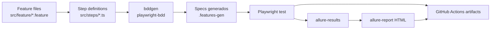
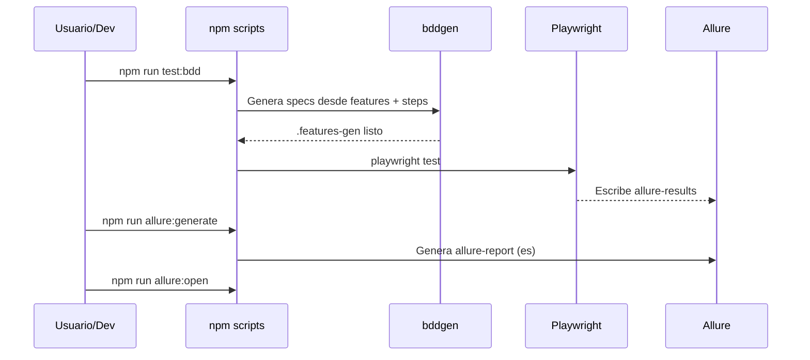
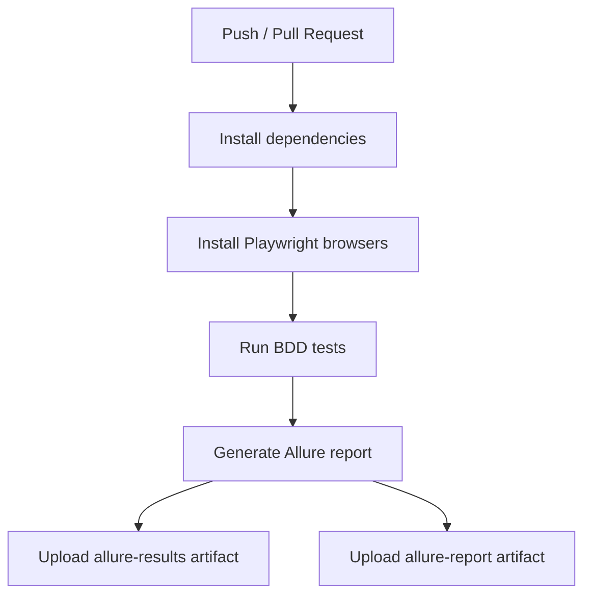

# AI Automation with Playwright

Proyecto de automatizacion E2E orientado a aprendizaje practico con:

- Playwright como motor de pruebas.
- BDD con `playwright-bdd` (Gherkin + Steps).
- Reporteria con Allure (UI en espanol).
- Ejecucion automatica en GitHub Actions.

El objetivo es cubrir flujos de negocio reales (registro de usuario) con una base mantenible, legible y lista para escalar.

---

## Tabla de contenido

- [Vision general](#vision-general)
- [Arquitectura del proyecto](#arquitectura-del-proyecto)
- [Stack tecnologico](#stack-tecnologico)
- [Estructura de carpetas](#estructura-de-carpetas)
- [Flujo de ejecucion BDD](#flujo-de-ejecucion-bdd)
- [Escenarios cubiertos](#escenarios-cubiertos)
- [Configuracion de Playwright](#configuracion-de-playwright)
- [Reporteria con Allure](#reporteria-con-allure)
- [Integracion continua (CI)](#integracion-continua-ci)
- [Instalacion y uso local](#instalacion-y-uso-local)
- [Comandos disponibles](#comandos-disponibles)
- [Buenas practicas del proyecto](#buenas-practicas-del-proyecto)
- [Troubleshooting](#troubleshooting)
- [Roadmap sugerido](#roadmap-sugerido)
- [Contribuir](#contribuir)

---

## Vision general

Este repositorio implementa un pipeline de testing BDD de extremo a extremo:

1. Se escriben escenarios de negocio en Gherkin (`.feature`).
2. Se implementan pasos reutilizables en TypeScript.
3. `playwright-bdd` genera specs ejecutables.
4. Playwright ejecuta pruebas en varios navegadores.
5. Allure genera reportes navegables en HTML.
6. GitHub Actions ejecuta todo en CI y adjunta artefactos.



---

## Arquitectura del proyecto

La arquitectura separa claramente:

- **Negocio (que se prueba)**: escenarios en Gherkin.
- **Automatizacion (como se prueba)**: steps en TypeScript.
- **Ejecucion tecnica**: Playwright + proyectos multi-browser.
- **Observabilidad**: reportes Allure y artefactos de CI.

Esta separacion permite que el lenguaje funcional se mantenga cerca del negocio, mientras la logica tecnica se centraliza en los steps y helpers.

---

## Stack tecnologico

- **Node.js + npm**
- **Playwright** (`@playwright/test`)
- **BDD adapter** (`playwright-bdd`)
- **Allure Reporter** (`allure-playwright`)
- **Allure CLI** (`allure-commandline`)
- **TypeScript para steps** (`.ts`)

---

## Estructura de carpetas

```text
.
|-- .github/
|   `-- workflows/
|       `-- playwright.yml
|-- .features-gen/                # specs generados automaticamente (no editar manualmente)
|-- src/
|   |-- feature/                  # archivos Gherkin
|   |   |-- example.feature
|   |   `-- signup.feature
|   `-- steps/                    # implementacion Given/When/Then
|       |-- example.ts
|       `-- signup.ts
|-- allure-results/               # resultados crudos para Allure
|-- allure-report/                # reporte HTML generado
|-- test-results/                 # salidas tecnicas de Playwright
|-- package.json
`-- playwright.config.ts
```

---

## Flujo de ejecucion BDD



---

## Escenarios cubiertos

### Feature principal: registro de usuario

Archivo: `src/feature/signup.feature`

Cobertura funcional actual:

- Registro exitoso con datos validos.
- Registro fallido por campo obligatorio vacio (Scenario Outline con multiples ejemplos).
- Registro fallido por email invalido (Scenario Outline con multiples ejemplos).
- Registro fallido con email ya registrado.
- Verificacion post-registro en login.

### Feature de ejemplo

Archivo: `src/feature/example.feature`

- Navegacion basica y validacion de contenido en pagina de referencia.

---

## Configuracion de Playwright

Archivo: `playwright.config.ts`

Puntos clave:

- Integracion BDD mediante `defineBddConfig`.
- `forbidOnly` activado en CI.
- Retries en CI (`2`) y `workers` en CI (`1`) para estabilidad.
- Ejecucion multi-browser:
  - Chromium
  - Firefox
  - WebKit
- Reporter activo: `allure-playwright` con salida en `allure-results`.
- `baseURL` configurada para `https://sauce-demo.myshopify.com`.

---

## Reporteria con Allure

El proyecto genera reportes Allure en espanol (`--lang es`).

### Flujo de reporte

1. Correr pruebas para poblar `allure-results`.
2. Generar HTML en `allure-report`.
3. Abrir reporte localmente en navegador.

### Valor de Allure en este proyecto

- Vista ejecutiva de estado general.
- Trazabilidad por suite/escenario/caso.
- Artefactos y detalle por test.
- Salida portable como artefacto en CI.

---

## Integracion continua (CI)

Archivo: `.github/workflows/playwright.yml`

Pipeline actual:

1. Trigger en `push` y `pull_request` a `main/master`.
2. Instala dependencias (`npm ci`).
3. Instala navegadores Playwright (`npx playwright install --with-deps`).
4. Ejecuta suite BDD (`npm run test:bdd`).
5. Genera reporte Allure (`npm run allure:generate`).
6. Publica artefactos:
   - `allure-results/`
   - `allure-report/`



---

## Instalacion y uso local

### Prerrequisitos

- Node.js LTS recomendado.
- npm disponible.

### Instalacion

```bash
npm ci
npx playwright install --with-deps
```

### Ejecucion completa

```bash
npm run test:bdd
npm run allure:generate
npm run allure:open
```

---

## Comandos disponibles

Definidos en `package.json`:

- `npm run bddgen`: genera specs desde Gherkin + Steps.
- `npm run test:bdd`: genera specs y ejecuta pruebas.
- `npm run test:bdd:list`: lista pruebas sin ejecutar.
- `npm run allure:generate`: genera reporte HTML Allure en espanol.
- `npm run allure:open`: abre el reporte generado.

---

## Buenas practicas del proyecto

- Mantener lenguaje de negocio en `.feature` y logica tecnica en `steps`.
- Reutilizar helpers para evitar duplicacion de selectores y acciones.
- Preferir `Scenario Outline` cuando solo cambian datos de entrada.
- Nombrar escenarios con intencion funcional (que valor valida).
- No editar archivos en `.features-gen` de forma manual.
- Antes de PR: ejecutar suite local y revisar Allure.

---

## Troubleshooting

- **No abre Allure**: ejecutar primero `npm run allure:generate`.
- **No hay resultados en Allure**: verificar que corriste `npm run test:bdd`.
- **Errores de browser en local**: reinstalar navegadores con `npx playwright install --with-deps`.
- **Cambios no reflejados en tests BDD**: regenerar specs con `npm run bddgen`.
- **Tests inestables en CI**: revisar trazas y artefactos Allure del workflow.

---

## Roadmap sugerido

- Agregar tags BDD (`@smoke`, `@regression`) para ejecucion selectiva.
- Incorporar mas validaciones de mensajes de error en UI.
- Separar helpers comunes en modulos dedicados.
- Definir convenciones de naming para features y steps.
- Añadir checklist de calidad para PRs (tests + reporte).

---

## Contribuir

1. Crea una rama desde `main`.
2. Implementa cambios en features/steps segun corresponda.
3. Ejecuta local:
   - `npm run test:bdd`
   - `npm run allure:generate`
4. Verifica que el reporte este correcto.
5. Abre PR con descripcion funcional y evidencia.

---

## Licencia

Proyecto bajo licencia `ISC` (ver `package.json`).
